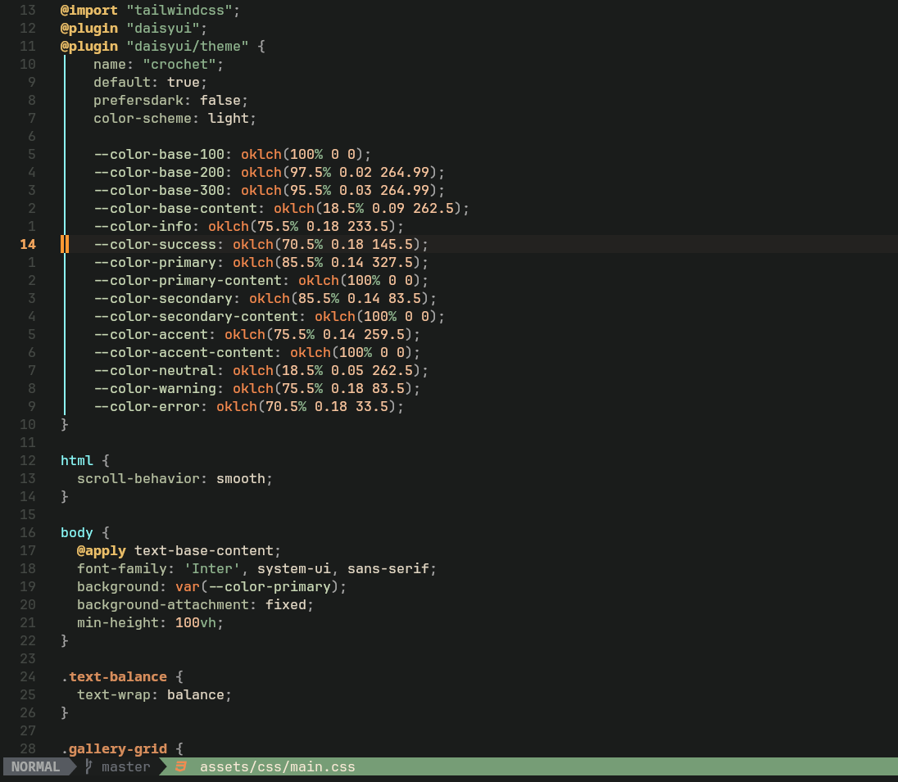
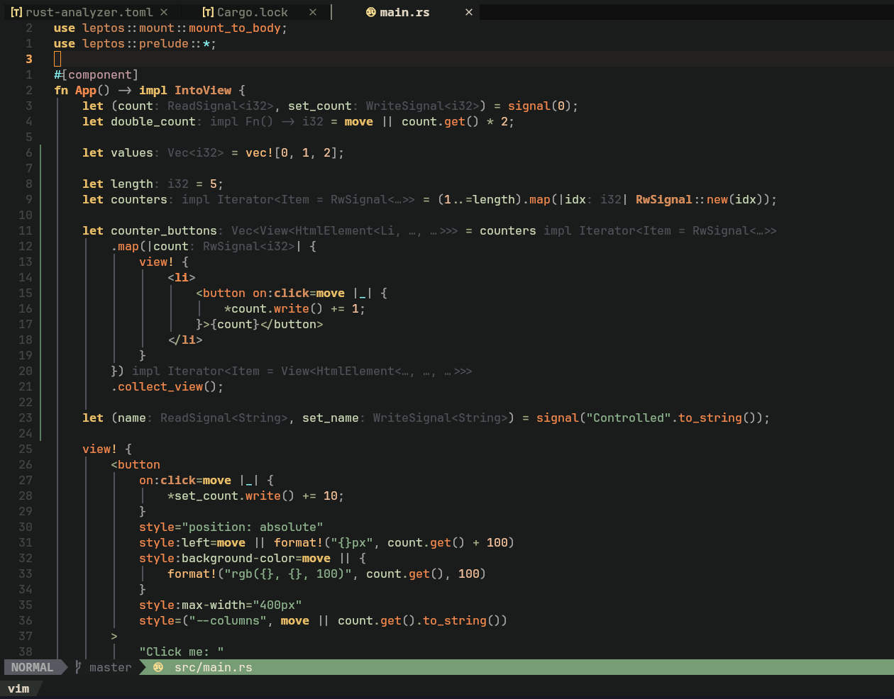

# Earthshaker.nvim

**A warm, earthy Neovim theme built by Remus Alexander**

Earthshaker is a grounded, moody theme designed for terminal dwellers who prefer dark mode with soul. Inspired by twilight forests, aged parchment, and the quiet before revelation.

---

## 🌿 Features

- Full support for `nvim` UI elements
- Treesitter syntax highlights
- Lualine-compatible statusline
- works with neo-tree, nvim-tree, and snacks pickers
- Minimalist, earthy color palette
- Built with Lua, for modern Neovim setups

---

## 📦 Installation (with lazy.nvim)

```lua
return {
  "remusearthshaker/earthshaker.nvim",
  lazy = false,
  priority = 1000,
}
```

then within a separate file you can specify

```lua
return {
    "LazyVim/LazyVim",
    opts = {
        colorscheme = "earthshaker"
    }
}
```

or you can run `:colorscheme earthshaker` within neovim

---

## Images




## 🪪 License

This theme is licensed under the [GNU General Public License v3.0](LICENSE). Use it, fork it, modify it. Just remember to respect the spirit of open source.
